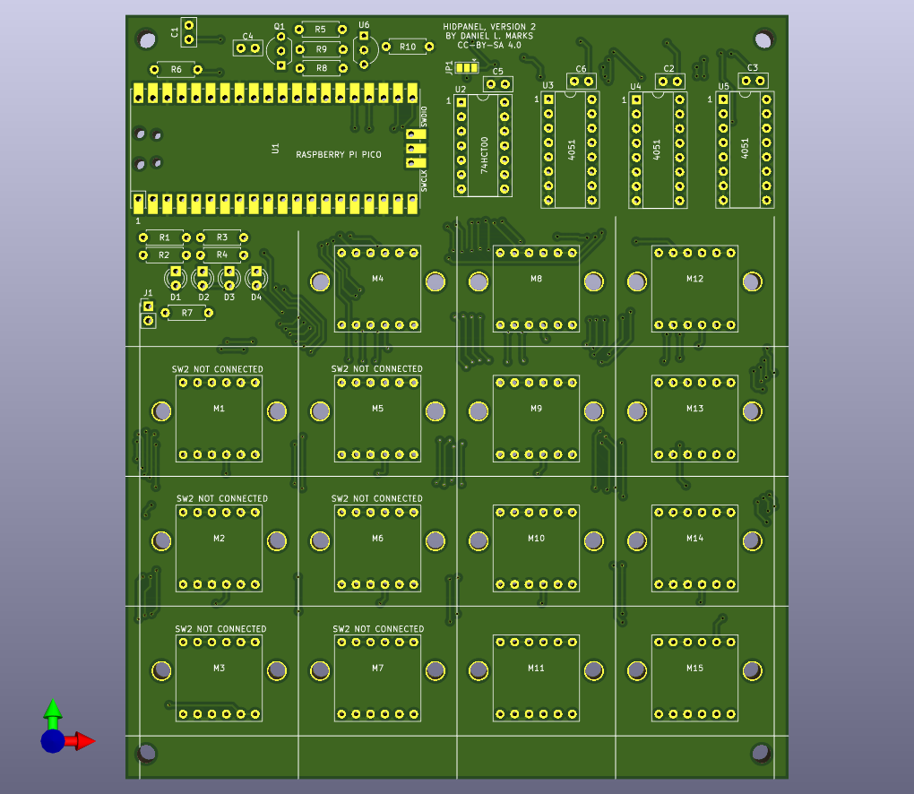
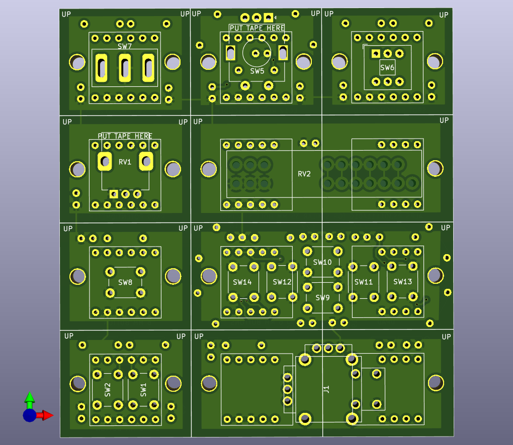

# HIDPanel

This is a customizable HID controller for game panels.  The HIDPanel has positions for up to 15 plug in control modules.  These modules can be single buttons, button pairs, rotary encoders, rotary potentiometers, slide potentiometers, and dual axis joysticks (PS4 or Xbox One type replacement joysticks).

The device appears as a USB CDC serial port, a USB HID keyboard, and a USB HID gamepad.  The actions of each module is configured through the serial port.  A command string configures the Keyboard or Gamepad controls to be triggered in response to each action.

# Commands

The commands are sent via the USB CDC serial port terminated by the enter character.  Here are the commands:

SET &lt;module number&gt; &lt;action number&gt; &lt;action command string&gt;

Sets the action command string corresponding to the action number for the given module number (1 to 15).

SHOW &lt;module number&gt;

Shows the current command strings for the module number.  If the module number is zero, show the action strings for all of the modules.

WRITE

Writes the current configuration to flash memory to be restored on power up.

HELP

Display the help (the list of commands).

# Module inputs

Each module has three inputs.  Switch 1, which is a digital only input, switch 2, which is digital or analog, and an analog input, which can be used as a digital or analog input.

The action numbers are:

- 100: Button 1 Pressed (grounded)
- 101: Button 1 Released (high)
- 200: Button 2 Pressed (grounded)
- 201: Button 2 Released (high)
- 300: Analog axis pressed (grounded)
- 301: Analog axis released (high)
- 302: Analog axis moved
- 311: Analog axis position 1/9 (left most)
- 312: Analog axis position 2/9
- 313: Analog axis position 3/9
- 314: Analog axis position 4/9
- 315: Analog axis position 5/9 (center) 
- 316: Analog axis position 6/9
- 317: Analog axis position 7/9
- 318: Analog axis position 8/9
- 319: Analog axis position 9/9 (right most)
- 400: Rotary encoder left
- 401: Rotary encoder right

# Command string

The command string is a sequence of one or two character codes separated by commas.  It should not contain any spaces.  There are three modes.  The mode needs to be selected before the commands for the mode are used.  Multiple modes may be used in the command string by switching between them.  The default is keyboard mode.

- LD: LED Mode
  - Hx: Turn on LED x (x = 1 to 4)
  - Lx: Turn off LED x (x = 1 to 4)
- GP: Gamepad Mode
  - Gx: Set axis x to analog input (x = 1-6, 1=left stick x, 2=left stick y, 3=left stick z, 4=right stick x, 5=right stick y, 6=right stick z)
  - Zx: Set axis x to switch 2 analog input
  - Dx: Set Dpad input to value x (x = 0-8, 0=Centered, 1=Up, 2=Up Right, 3=Right, 4=Down Right, 5=Down, 6=Down Left, 7=Left, 8=Up Left)
  - Hx: Press button x (x=1 to 32)
  - Lx: Release button x
- KB: Keyboard Mode
  - Blank (zero length): keyboard release (two consective commas).
  - LC: Select left control for next key
  - LS: Select left shift for next key
  - LA: Select left alt for next key
  - LG: Select left gui for next key
  - RC: Select right control for next key
  - RS: Select right shift for next key
  - RA: Select right alt for next key
  - RG: Select right gui for next key
  - NU: No key (keyboard release)
  - A-Z: Press key A to Z
  - 0-9: Press key 0 to 9
  - EN: Enter
  - ES: Escape
  - BK: Backspace
  - TB: Tab
  - SP: Space bar
  - -: Minus key
  - =: Equal key
  - [: Left bracket
  - ]: Right bracket
  - \\: Backslash
  - E1: Europe 1
  - E2: Europe 2
  - ; : Semicolon
  - ` : Grave
  - CM: Comma
  - .: Period
  - /: Slash
  - CC: Caps Lock
  - F1-F9: F1 to F9
  - FA: F10 key
  - FB: F11 key
  - FC: F12 Key
  - PS: Print Screen
  - SL: Scroll Lock
  - PA: Pause
  - IN: Insert 
  - HO: Home
  - PU: Page Up
  - DE: Delete
  - ED: End
  - PD: Page Down
  - AR: Arrow Right
  - AL: Arrow Left
  - AD: Arrow Down
  - AU: Arrow Up
  - NL: Num Lock
  - KD: Keypad Divide
  - KM: Keypad Multiple
  - KS: Keypad Subtract
  - KA: Keypad Add
  - KE: Keypad Enter
  - K0-K9: Keypad 0 to 9
  - KL: Keypad Decimal Point
  - KQ: Keypad Equal

Examples:

- KB,LS,H,,E,,L,,L,,O, : Type the word "HELLO" with the left shift key pressed down during "H" (to capitalize it).
- GP,G2 : Take the analog value of the module and set it to the left stick Y axis.
- GP,D1,D0,D1,D0,D5,D0,D5,D0,D7,D0,D3,D0,D3,D0,H2,L2 : Do combination up,up,down,down,left,right,left,right (on DPad), and then press and release button 2 (Fatality!)
- GP,H1,LD,H2 : press button 1, light up LED 2
- KB,F1,GP,H1,KB,,LD,L3,GP,L1 : Press keyboard key F1, press button 1 on gamepad, turn off LED 3, release button 1 on gamepad.  Button F1 remains pressed.

